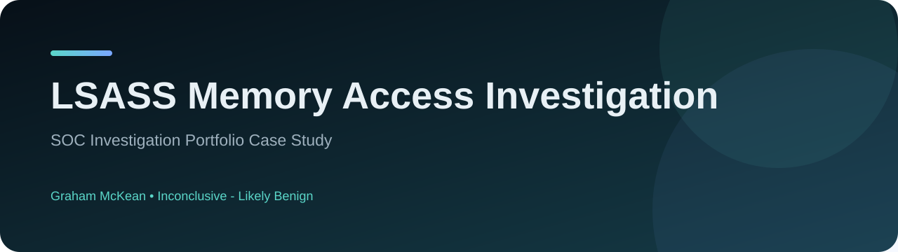

# LSASS Memory Access Investigation

**Splunk + Sysmon investigation of credential-dumping detection logic**

 

## Case study overview

A SOC investigation into a Sysmon Event ID 10 alert where Sysmon.exe accessed lsass.exe with GrantedAccess 0x1fffff. The investigation validated the event, searched for corroborating credential-dumping activity and documented the validation gaps that prevented a conclusive benign closure.

| Area | Detail |
| --- | --- |
| Severity | **Medium** |
| Assessment | **Inconclusive - Likely Benign** |
| Environment | Kerning City Dental (KCD) |
| MITRE ATT&CK | T1003 - Credential Dumping (Sysmon rule tag) |
| Full case study | **[View GitHub Pages site](https://grhmmckean33.github.io/LSASS-Memory-Access-Investigation/)** |
| Investigation report | **[Open PDF](report/SOC_Investigation_Report_LSASS_Memory_Access.pdf)** |

## Key findings

- Sysmon Event ID 10 confirmed C:\Windows\Sysmon.exe accessing C:\Windows\System32\lsass.exe as NT AUTHORITY\SYSTEM.
- No supporting evidence of Mimikatz, ProcDump, comsvcs.dll, MiniDumpWriteDump, sekurlsa or LSASS memory-dump creation was identified in the reviewed telemetry.
- The Sysmon binary signature, hash, version, publisher and deployed configuration could not be independently validated.
- The final assessment was kept evidence-led: Inconclusive - Likely Benign rather than conclusively Benign.

## Investigation approach

- Validated the original Splunk/Sysmon alert and source/target process context.
- Reviewed surrounding telemetry for credential-dumping indicators and utilities.
- Separated detection-rule tagging from proof of malicious credential dumping.
- Documented evidence limitations and recommended wider recurrence/validation checks.

## SOC skills demonstrated

`SIEM alert investigation`, `Sysmon Event ID 10 analysis`, `Credential-dumping triage`, `Evidence-based classification`, `Negative-evidence handling`, `Investigation limitations and reporting`

## Report structure

The full PDF report contains the investigation findings, evidence-led summary, timeline where applicable, 5Ws and 1H, observed or incident-associated indicators, assessment, recommendations and documented investigation limitations.

---

**Prepared by Graham McKean**  
SOC investigation portfolio case study. External indicators are defanged where applicable.
